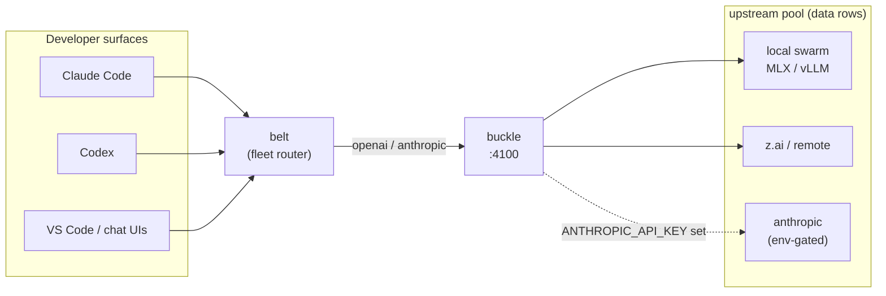

# buckle

LLM gateway: two-dialect transport + governance in one Bun/TypeScript
process. The LiteLLM-replacement serving layer of the
[klh agent stack](https://github.com/klh/suspenders) — belt routes,
buckle serves.



## What it does

- **Two wire dialects** — OpenAI `/v1/chat/completions` and Anthropic
  `/v1/messages` — with SSE pass-through and a usage-only tee.
- **Upstreams are data, not code** — `upstreams.yaml` group rows
  (`url`, `dialect`, `adapter`, `api_key_env`), the same move LiteLLM's
  own long tail made (`openai_like/providers.json`). The provider catalog
  (W150) carries 100+ providers as rows; unknown providers ride the
  `openai-compat` catch-all with `adapter_config`.
- **Cloud rows ship dormant** — committed rows are env-gated: a deployment
  with `api_key_env: ANTHROPIC_API_KEY` activates only when that variable
  exists at runtime. Keys never live in committed files.
- **Ladder routing** — ordered fallback walk per `routing-policy.yaml`,
  retry with retry-after honoring, cooldown ejection after repeated
  failures, hour-bucket usage ledger.
- **Governance seams** — budgets, per-key/team ceilings, entitlement
  checks and federation hooks hang off the router core (see the suspenders
  design docs).

## Status

Shadow-port complete, cut-over managed by the control plane
(`docs/cut-over-runbook.md`): the gateway binds the serving port only
after the owner flips it; until then the previous gateway keeps serving.

## Run

```sh
bun install
bun run src/server.ts        # binds the configured port (loopback default)
bun test                     # adapter, ladder and citizenship suites
```

`upstreams.yaml` documents the row format inline. Override at runtime with
`BUCKLE_UPSTREAMS=/path/to/extra.yaml` (merged by group name; never
committed).

## Design sources

- `docs/design/belt-native-router-2026-10-01.md` (suspenders repo) —
  architecture and build order
- `docs/research/litellm-internals-2026-10-01.md` — line-precise LiteLLM
  references (usage sniff, retry-after semantics, cooldown)
- `docs/design/buckle/adapters-2026-10-01.md` — the five adapter families
  and the provider-as-data law

License: see [LICENSE](LICENSE). Litellm internals were studied as
documentation only; no code was copied.
